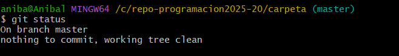

# Cómo Crear un Repositorio Local con Git

Este documento explica paso a paso cómo crear un repositorio local usando Git desde la consola. Es útil para gestionar proyectos de forma organizada, mantener un historial de cambios y trabajar con control de versiones.

---

## ¿Qué es un Repositorio Local?

Un repositorio local es una carpeta en tu computadora que contiene archivos de un proyecto, junto con toda la información de versiones y cambios rastreados por Git. Es la base para trabajar de forma individual o en equipo.

---

## Pasos para Crear un Repositorio Local

### 1. Abrir la Terminal

Abre la terminal o consola de tu sistema operativo.

---

### 2. Navegar hasta la Carpeta del Proyecto

Usa el comando `cd` para ir al directorio donde deseas iniciar el repositorio. Por ejemplo:

```bash
cd Documentos/proyecto
```
Si aún no tienes una carpeta, puedes crearla:

```bash
mkdir proyecto
cd proyecto
```
### 3. Inicializar el Repositorio
Una vez dentro de la carpeta, ejecuta el siguiente comando para inicializar un repositorio local:

```bash
git init
```

Este comando crea una carpeta oculta llamada .git, donde Git almacenará el historial de versiones y configuraciones del repositorio.

Resultado esperado:
---

---
### 4. Añadir Archivos al Repositorio
Crea o copia los archivos del proyecto dentro de la carpeta y luego usa:

```bash
git add archivo.txt
```


O para añadir todos los archivos del directorio:

```bash
git add .
```
### 5. Realizar el Primer Commit
Guarda los cambios añadidos con un mensaje explicativo:

```bash
git commit -m "Primer commit: estructura inicial del proyecto"
```


### 6. Verifica el Estado del Repositorio
Para comprobar los archivos que han sido modificados, añadidos o eliminados:

```bash
git status
```


## conclución
Crear un repositorio local con Git es un paso fundamental para gestionar de forma eficiente cualquier proyecto. A través de unos pocos comandos, puedes llevar un control detallado de los cambios realizados en tus archivos, facilitar el trabajo colaborativo y mantener un historial organizado del desarrollo. Esta práctica no solo mejora la organización del código, sino que también ayuda a prevenir errores y a recuperar versiones anteriores cuando sea necesario. Aprender a usar Git desde la consola te da mayor control y comprensión sobre el funcionamiento interno del control de versiones, lo cual es una habilidad clave en el desarrollo profesional.